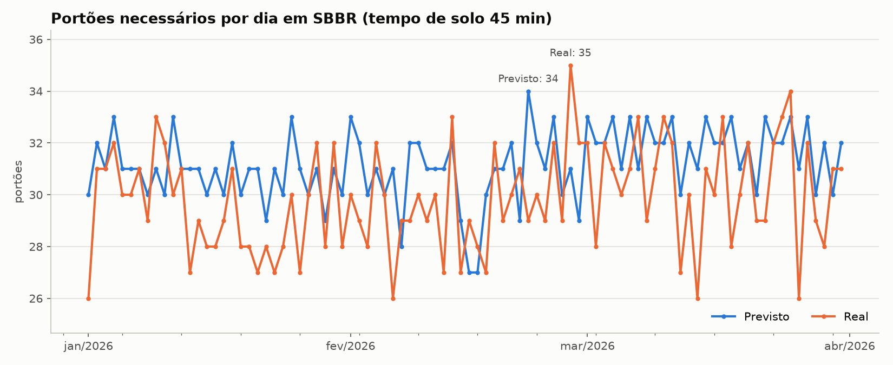
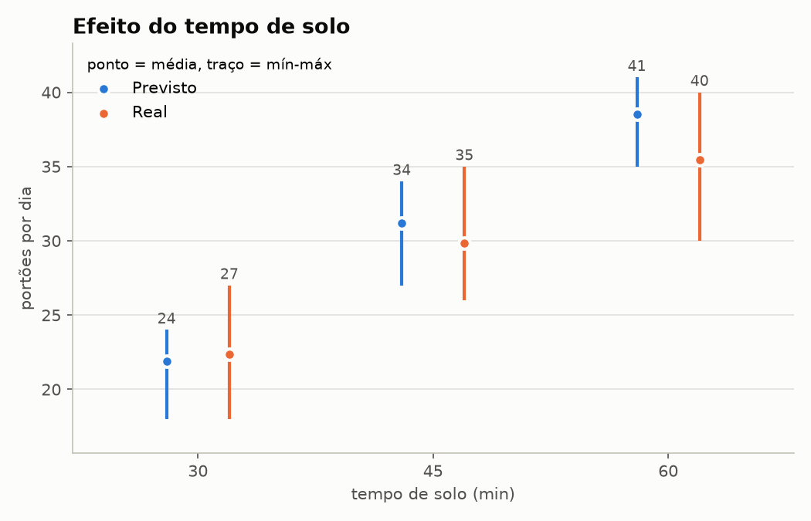
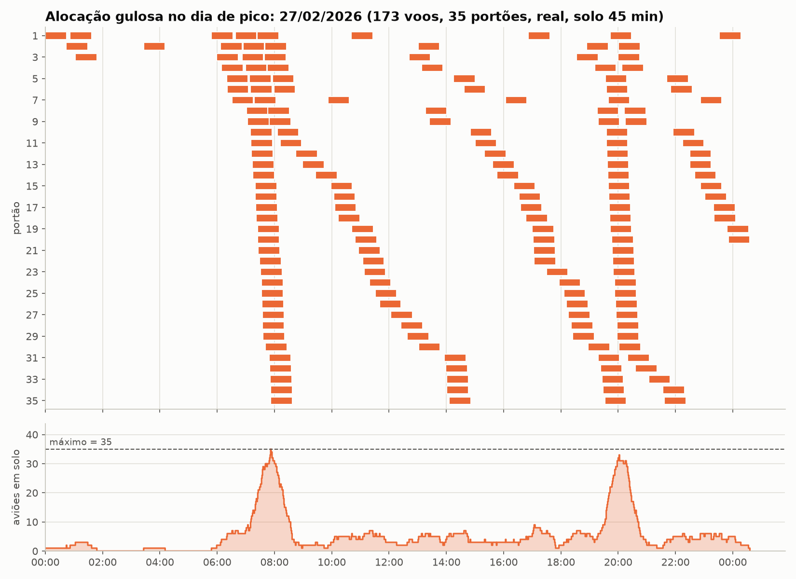

# G46_Greed_PA-26.2

## Aluno

| Matrícula | Aluno |
| :-------: | :---: |
| 222021826 | Victor Leandro Rocha de Assis |

## Apresentação

[Vídeo da apresentação no YouTube](https://youtu.be/AbrBsSINDEk)

Trabalho de **Projeto de Algoritmos (UnB, 2026.2)** sobre algoritmos gulosos.

**Pergunta:** quantos portões, no mínimo, o Aeroporto de Brasília (SBBR)
precisaria por dia para receber todos os voos que chegaram em janeiro,
fevereiro e março de 2026?

O problema é resolvido com **interval partitioning guloso** sobre dados reais
de voos da ANAC.

## Dados

- **Fonte:** base VRA (Voo Regular Ativo) da ANAC, no
  [portal de dados abertos da ANAC](https://www.gov.br/anac/pt-br/acesso-a-informacao/dados-abertos).
- **Arquivos:** `VRA_20261.json`, `VRA_20262.json` e `VRA_20263.json`
  (janeiro a março de 2026). Têm ~100 MB e não estão no repositório; baixe-os
  e coloque-os em `data/`.
- **Campos usados:** `ICAOEmpresaAérea`, `NúmeroVoo`, `ICAOAeródromoDestino`,
  `ChegadaPrevista`, `ChegadaReal` e `SituaçãoVoo`.

Ao todo são 14.744 chegadas realizadas em SBBR no período.

## Modelo

Cada chegada vira um intervalo de tempo em que o avião ocupa um portão.
Encontrar o menor número de portões é encontrar o menor número de "trilhos"
em que os intervalos cabem sem se sobrepor: o problema de **interval
partitioning**.

O modelo assume o seguinte:

- **Voos:** só entram voos com `SituaçãoVoo == "REALIZADO"` e destino `SBBR`.
- **Tempo de solo fixo:** o VRA não informa a matrícula da aeronave, então
  não dá para saber qual partida corresponde a cada chegada. Por isso cada
  chegada ocupa um portão por um tempo fixo a partir do pouso (padrão:
  45 min).
- **Intervalo semiaberto `[pouso, pouso + solo)`:** um portão liberado às
  10:00 pode receber um voo que pousa às 10:00.
- **Dias independentes:** o dia do voo é o dia do pouso, e cada dia é
  resolvido separadamente.
- **Período:** só entram os dias de 01/01 a 31/03. O VRA agrupa os voos pelo
  dia da partida, então 01/04 aparece com poucos pousos (voos que decolaram
  em 31/03) e foi descartado.
- **Dois cenários:** tudo é calculado com o horário **previsto**
  (`ChegadaPrevista`) e com o **real** (`ChegadaReal`). Horários `null`,
  `"N/A"` ou inválidos são descartados e contados; isso só acontece no
  previsto (144 voos sem `ChegadaPrevista`).
- **Sensibilidade:** tempos de solo de 30, 45 e 60 min.

## Algoritmo guloso

Implementado em [`src/absioso.py`](src/absioso.py):

1. Ordenar os voos pelo horário de pouso.
2. Manter um *min-heap* com `(horário em que libera, portão)` dos portões já
   abertos.
3. Para cada voo, olhar o portão que libera mais cedo, que está no topo do
   heap:
   - se ele já liberou, o voo vai para esse portão;
   - senão, nenhum outro portão está livre, e um novo portão é aberto.

**Complexidade:** O(n log n), por causa da ordenação e das operações no
heap. O(n) de memória.

### Por que é ótimo

Seja *d* a **profundidade**: o maior número de voos em solo ao mesmo tempo.

- **Limite inferior:** qualquer solução precisa de pelo menos *d* portões,
  porque *d* aviões simultâneos não podem dividir portão.
- **O guloso não passa disso:** ele só abre o portão *k* quando um voo pousa
  e os *k − 1* portões existentes estão todos ocupados. Nesse instante há *k*
  voos em solo, logo *k ≤ d*.

Portanto o guloso usa exatamente *d* portões, que é o mínimo possível.

Os testes verificam isso empiricamente. A função `max_simultaneos` calcula
*d* por uma varredura de eventos (+1 no pouso, −1 na liberação), e o
resultado é comparado com o do guloso em:

- 800 instâncias aleatórias, com duração fixa e variável e muitos empates de
  horário;
- todos os 540 dias reais (90 dias × 2 cenários × 3 tempos de solo).

Os dois valores bateram em todos os casos.

## Resultados

Portões necessários por dia, de 01/01 a 31/03/2026 (90 dias):

| Cenário | Solo | Voos | Descartados | Mín. | Média | Máx. | Dia de pico |
|---|---:|---:|---:|---:|---:|---:|---|
| Previsto | 30 min | 14.595 | 144 | 18 | 21,9 | 24 | 22/02 |
| Previsto | 45 min | 14.595 | 144 | 27 | 31,2 | 34 | 22/02 |
| Previsto | 60 min | 14.595 | 144 | 35 | 38,5 | 41 | 04/03 |
| Real | 30 min | 14.740 | 0 | 18 | 22,4 | 27 | 12/01 |
| Real | 45 min | 14.740 | 0 | 26 | 29,8 | 35 | 27/02 |
| Real | 60 min | 14.740 | 0 | 30 | 35,4 | 40 | 13/02 |

### O que os resultados mostram

- **O tempo de solo pesa muito.** Com o horário real, o pior dia vai de 27
  portões (30 min de solo) para 40 (60 min).
- **O horário real varia mais que o previsto.**
  - Com 45 e 60 min de solo, a média de portões é menor no real.
  - Em alguns dias, porém, os atrasos acumulam chegadas, e o real precisa de
    mais portões que o previsto: 35 contra 34 no pior dia com 45 min, e 27
    contra 24 com 30 min.
  - Planejar só pela malha prevista subestima o pior caso.
- **Os picos são curtos e concentrados.** No dia de pico (27/02, real,
  45 min) os 35 portões só são necessários em torno das 8h; há outro pico
  perto das 20h. No resto do dia bastam menos de 10.







## Estrutura

```
src/
  absioso.py   interval partitioning guloso + varredura de eventos
  carregar.py  leitura dos JSON, filtros e intervalos por dia
  analise.py   previsto x real x tempos de solo -> CSV em results/
  graficos.py  gráficos (matplotlib) em results/
tests/         pytest
results/       CSV e PNG gerados
data/          JSON da ANAC (fora do git)
```

## Como rodar

Requer Python 3.10+.

```bash
python -m venv .venv && source .venv/bin/activate
pip install -r requirements.txt
python -m src.analise    # gera results/portoes_por_dia.csv e results/resumo.csv
python -m src.graficos   # gera os PNG (precisa dos CSV acima)
pytest
```
